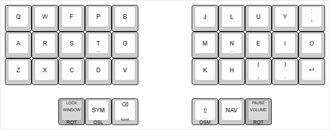

# ThrownException Keyboard
This repository documents all the details of my every-day keyboard and keymap.
> I use both Bertie2011 and ThrownException as online nicknames

The list of sections below will start with the keymap, followed by each of the keyboards I have built (newest first).

## Keymap
Many keymaps make use of holding keys to distinguish from their tap behavior. However, holding keys really sucks! For me it feels like tapping two keys is less effort than holding a key. So the philosophy behind the keymap is to be **strictly tap only**. If you're curious about how that's possible and which tricks were pulled to make it easier to use click the image below.

## Dilemma V2 - Bastard Keyboards
Since getting my first split keyboard I never stopped trying to optimize my keymap to the point that the most noticable discomfort was having to switch over to the mouse every now and then. I tried mouse keys, but could never get used to them so I started looking at the keyboards offered on bastardkb.com. The OLED displays were only used for layer/mod indicators, which I thought would be easier to spot if the keys themselves lit up as indicators with RGB. Throw in rotary encoders which I didn't have before and the decision was made. Click the image below for more details on the build.

## Kyria rev2.0 - splitkb.com
As a programmer I need to be able to type comfortably for many years. To avoid RSI related problems in the future, I wanted to stay ahead and get a more ergonomic keyboard. It was perfect timing, because I was transitioning from a laptop to a gaming PC at the same time, so I needed a new keyboard anyways. Click the image below for more details on the build.

