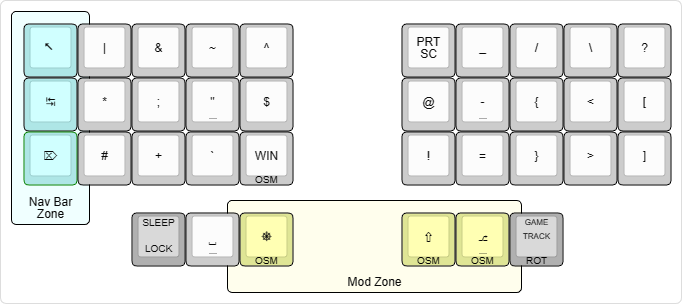
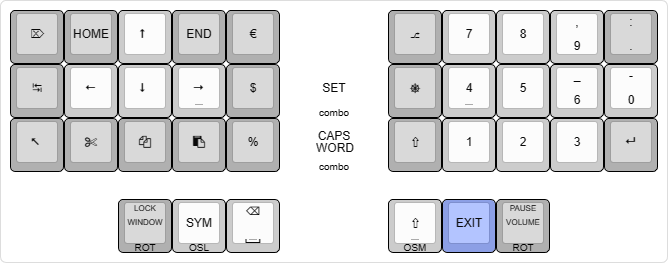
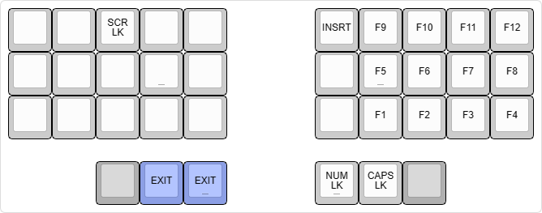
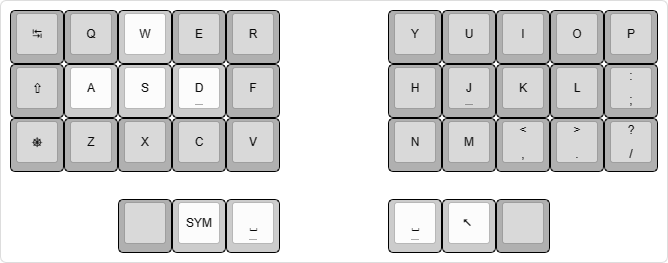

# ThrownException Keymap
When doing a deep dive into small keyboard keymaps, a lot of them seem to rely on holding keys, whether that's for switching layers, using modifiers or simply fitting another special character on the same key. 

This didn't feel right for me, because when I decide I want to put something on the screen, I only want to to think about what to do and not how to do it. I want my input to be instant and not be dependent on any kind of delay. Also the effort of holding a key and pressing another seems to be more than the effort of pressing two or even three keys shortly.

## Philosophy
* Use the Colemak Mod-DH base layout for improved ergonomics
* Avoid holding keys at all costs for instant input and decreased effort
* Avoid thinking about which layers were activated earlier, only think about the next key.
  * All layers can be activated from any other layer, no need to disable a layer first
  * The [symbols layer](#symbols-layer) has a special implementation that allows repetition and base layer access at the same time. 
* Exclusive layers, only 1 extra layer can be active at a time

## QMK Libraries
My keymap contains tons of custom code and concepts. If you want to really understand what's going on or would like to try out some unique features for yourself, check out my [QMK lib folder](/qmk-lib/README.md).

## Base Layer
The layer follows Colemak Mod-DH. The non-alpha keys have been filled by most frequently used characters. The thumb keys are occupied by space, symbols layer, backspace and nav layer keys. Enter is created with space enter, and the home keys can be pressed at the same time for caps word functionality. The outer thumb keys are rotary encoders with key press functionality.

## Symbols Layer
The symbols layer consists of 3 [zones](/qmk-lib/zones/) that together fill the entire keyboard: The symbols zone, the nav bar zone and the mod zone. Note that ESC within the nav bar zone also turns that zone off.

On the right there are delete, tab and escape keys. On the bottom there is CTRL on the left thumb, SHIFT and ALT on the right thumb.

Some insights on why I picked these positions for the symbols
* I'm a programmer, so access to brackets is important. I put the opening brackets on the home row, because editors often auto complete the closing brackets.
* Logic operators & (`and`) and | (`or`) are next to each other
* Mark down \* (`list item`) and # (`header`) are next to each other
* The second symbol column on the left contains all symbols that indicate something will follow (`and then...`)
* Quotes " and ` are next to each other
* Regex symbols ^ (`start of line`) and $ (`end of line`) are next to each other
* C# string modifiers $ (`allow variables`) and @ (`literal text with new line support`) are in the same position from each hand
* WIN modifier is on the same key as V, allowing for rapid clipboard access (WIN + V)
* The second symbol column on the right contains all horizontal line symbols
* Both slash types are next to each other

## Navigations Layer
This layer has arrow navigation on the left and a numpad on the right. It automatically deactivates when pressing space, backspace or enter. The modifiers are not one shot on this layer, since they are to be used with multiple arrow key presses.

## Settings Layer
The settings layer only contains F-keys, some locking keys and keys for controlling RGB settings.

## Game Layer
The outer thumb key on the symbol layer will cause the keyboard to switch to this base layer. It's a simple QWERTY base layer with the left hand shifted over to bring WASD under the correct fingers. It also has another column on the left with commonly used modifier keys and an escape on one of the thumb keys.

