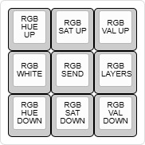

# RGB Layers
With RGB Layers you can define an rgb color code for every key per layer, similar to the ZSA Oryx configurator (from the same company as Ergodox EZ and Moonlander). 

> You're going to need a few kilobytes of space for this feature. It might not fit on a Pro Micro based controller.

## Setting up
To get started, follow these instructions:

* Copy the `x_rgb.h`, `x_rgb.c` and `rgb_matrix_user.inc` files to your keymap folder.
* Add to rules.mk:
   ```
   SRC += x_rgb.c
   RGB_MATRIX_CUSTOM_USER = yes
   ```
* Add to config.h:
    ```C
    #define SPLIT_LAYER_STATE_ENABLE // Sync information between both halves of split keyboard.
    #define SPLIT_MODS_ENABLE
    #define SPLIT_LED_STATE_ENABLE
    #define ENABLE_RGB_MATRIX_SOLID_COLOR
    #define ENABLE_RGB_MATRIX_CYCLE_LEFT_RIGHT
    #define X_LAYER_EFFECT_DEFAULT 0xRRGGBB // hex color code, but replace # with 0x
    ```
* Check out the other RGB [configuration options](https://docs.qmk.fm/#/feature_rgb_matrix?id=additional-configh-options) (including default mode and brightness)
* At the top of your `keymap.c` add:
    ```C
    #include "x_rgb.h"

    void keyboard_post_init_user(void) {
        x_rgb_set_layer(); // Switches to the custom RGB layers mode.
    }
    ```

## Defining color maps
In order to specify colors per key per layer, you must define the RGB maps which look a lot like your `keymaps`. For example on a simple 3 key macropad, you might want to assign red/green/blue for each of the keys like this:

```C
// You should have your keymap already defined somewhere
const uint16_t PROGMEM keymaps[][MATRIX_ROWS][MATRIX_COLS] = {
    [LAYER_BASE] = LAYOUT(
        KC_X, KC_C, KC_V
    )
};
// Now define the rgbmaps variable like this:
const uint32_t PROGMEM rgbmaps[MAX_LAYER][MATRIX_ROWS][MATRIX_COLS] = {
    // Use the same layer/layout templating syntax, but use color codes instead of key codes (in 0xRRGGBB format).
    [LAYER_BASE] = LAYOUT(
        0xFF0000, 0x00FF00, 0x0000FF
    )
};
```

## Color Aliases
The following aliases are available that you can use instead of color codes.

Alias|Value|Description
--:|:--|:--
`OOOOOOOO`|0xFFFFFF|White
`XXXXXXXX`|0x000000|Black
`________`|0x000001|Transparent (See below)

> NOTE: The aliases are 8 characters wide. Don't get them confused with the 7 character wide key code aliases.

## Overrides, defaults and underglow LEDs
Extra functions can be implemented to supply overrides and defaults on top of the RGB color maps. This can also help you implement dynamic underglow LEDs, since they cannot be addressed in the `rgbmaps` variable.

To understand how the color of a key is determined, have a look at the following list. Starting from the top, the first item that isn't returning transparent ( `________` ) will define the color.

1. Color override function (great for modifier indicators or other special events):
    ```C
    uint32_t x_rgb_get_override_color_user(led_data* data) {
        // Calculate override color here.

        return ________; // Fall back to the next color input
    }
    ```
2. Color codes in the `rgbmaps` definition. If an LED is not mapped to a key (e.g. because it's part of underglow), then this step will be skipped.
3. Color default function (great for creating layer specific underglow LED colors):
    ```C
    uint32_t x_rgb_get_default_color_user(led_data* data) {
        // Calculate override color here.

        return ________; // Fall back to the next color input
    }
    ```
4. The `#define X_LAYER_EFFECT_DEFAULT 0xRRGGBB` option in your `config.h`.
5. The color Black.

The `led_data` object can be accessed like this: `data->row`. You can find all fields below.
Field|Description
--:|:--
`row` and `col`|Defines the vertical and horizontal indexes in the key matrix. This does not necessarily match the position of the keycode in the keymap. Read up on it [here](/qmk-lib/understanding-key-indexes.md). These values will be equal to `NO_LED` if the LED is not associated with a key (e.g. for underglow or indicator lights).
`index`|The number that identifies the LED.
`x` and `y`|The physical position of the LED on the keyboard, not restricted by any grid or key indexes.
`flags`|See QMK [RGB Matrix Flags](https://docs.qmk.fm/#/feature_rgb_matrix?id=flags).

## Switching color modes
The built-in switching RGB mode key codes only switch the RGB mode, but do not switch between different saturations or values that were distinct between RGB modes. This proved troublesome, since both the solid color and the color cycle effects turn fully white with saturation 0 (while only the solid color effect was intended to be white).

So I added a few functions that switch both the RGB mode and the saturation/value/hue, which can be used with [Macros](https://docs.qmk.fm/feature_macros#using-macros-in-c-keymaps) aka custom keycodes.

Function|Description
--:|:--
`x_rgb_set_white()`|Switches to the solid color effect with hue/saturation set to 0 (white) and copying the current value (brightness). These changes are not saved to EEPROM and will revert after rebooting the keyboard loses power.
`x_rgb_set_cycle_left_right()`|Switches to the rainbow cycle effect, setting saturation to max (255) and copying the current value (brightness). These changes are not saved to EEPROM and will revert after the keyboard loses power.
`x_rgb_set_layer()`|Switches to layered RGB mode, does not modify anything else.

## Selecting colors from your keyboard
You might be curious what a color would look like on your keyboard. The library has an `x_rgb_send()` function, which prints the currently selected color, so you can make a layout that lets you browse through all the different colors and then simply type out the color into your keymap. Start by finding a spot to define the following keymap:

  
Which should look a little like this:
```Cpp
const uint16_t PROGMEM keymaps[][MATRIX_ROWS][MATRIX_COLS] = {
    [<LAYER>] = LAYOUT(
        RM_HUEU,        RM_SATU,        RM_VALU,
        CKC_RGB_WHITE,  CKC_RGB_SEND,   CKC_RGB_LAYER
        RM_HUED,        RM_SATD,        RM_VALD
    )
};
```
The top and bottom rows are built-in keycodes to adjust hue, saturation and value (brightness). The middle row has Macros that allow setting the RGB modes and printing the hex code. You can create the macros like this:
```C
enum custom_keycodes {
    CKC_RGB_WHITE = SAFE_RANGE,
    CKC_RGB_LAYER,
    CKC_RGB_SEND,
};

bool process_record_user(uint16_t keycode, keyrecord_t *record) {
    if (record->event.pressed) {
        if (keycode == CKC_RGB_WHITE) {
            x_rgb_set_white();
            return false;
        } else if (keycode == CKC_RGB_LAYER) {
            x_rgb_set_layer();
            return false;
        } else if (keycode == CKC_RGB_SEND) {
            x_rgb_send();
            return false;
        }
    }

    return true;
}
```

After flashing your new keymap, you can use the middle left button to switch to the white solid color mode, then press the top middle (increase saturation) and top right (increase brightness) buttons until a nice color appears. Use the buttons in the top and bottom rows to find the perfect color and then press the middle button to automatically start typing the associated hex code (`0xRRGGBB`).

Do note that the color you see will be the color that's shown when your keyboard is on max brightness. So if you want max brightness colors at max brightness keyboard, then make sure to increase the value (top right button) to 100% before saving the color code.

If you want more granular levels of color adjustment, you can add the following defines to your config.h file:
```C
#define RGB_MATRIX_HUE_STEP 4 // Default: 8
#define RGB_MATRIX_SAT_STEP 8 // Default: 16
#define RGB_MATRIX_VAL_STEP 8 // Default: 16
```